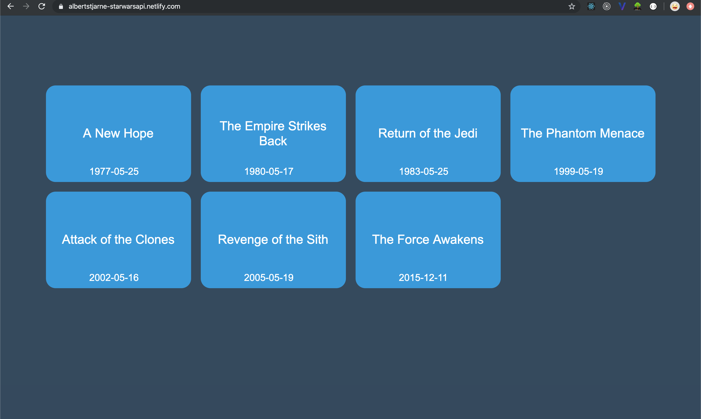
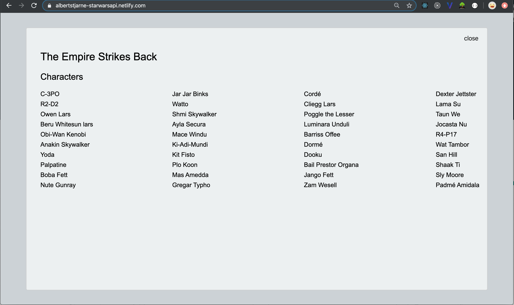
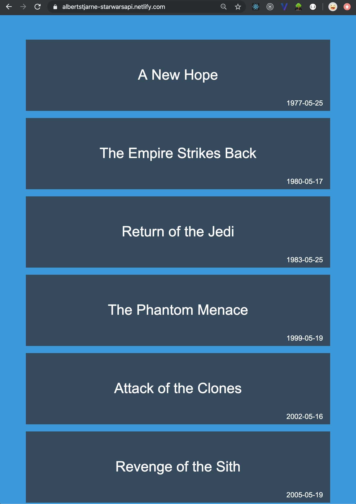
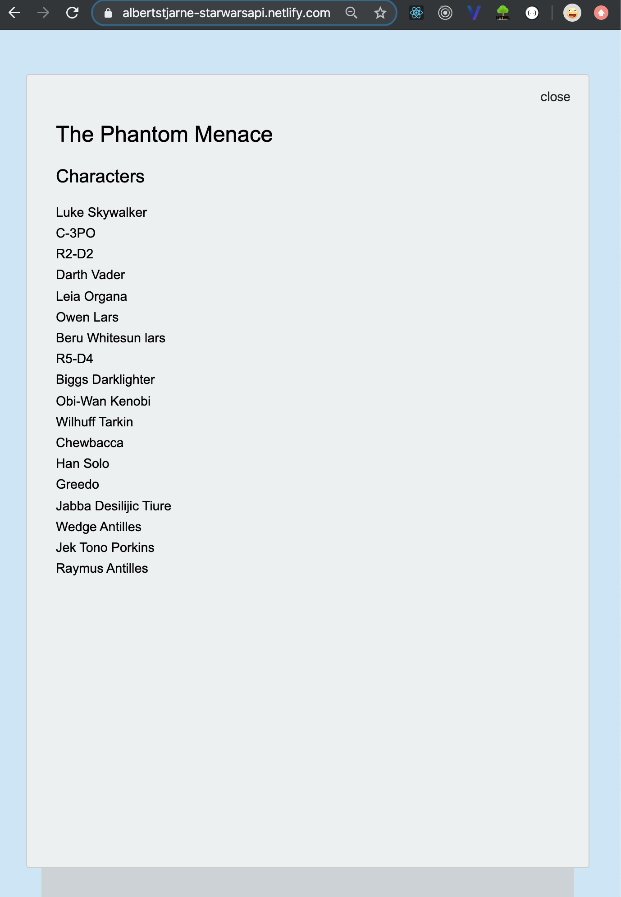
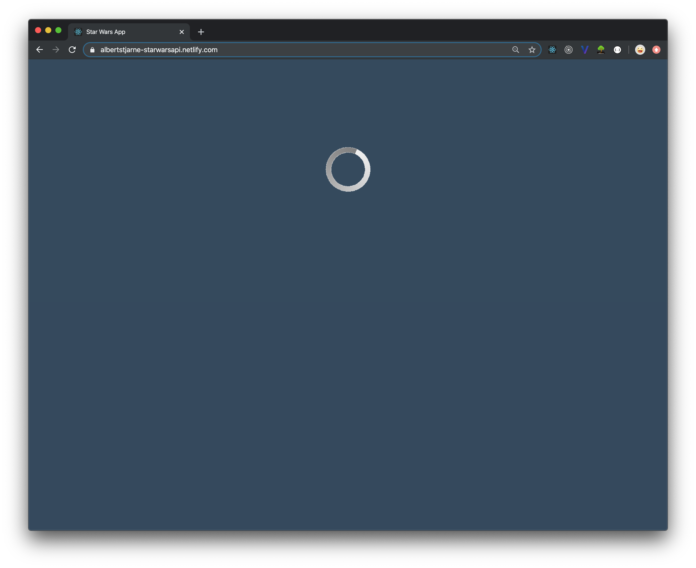
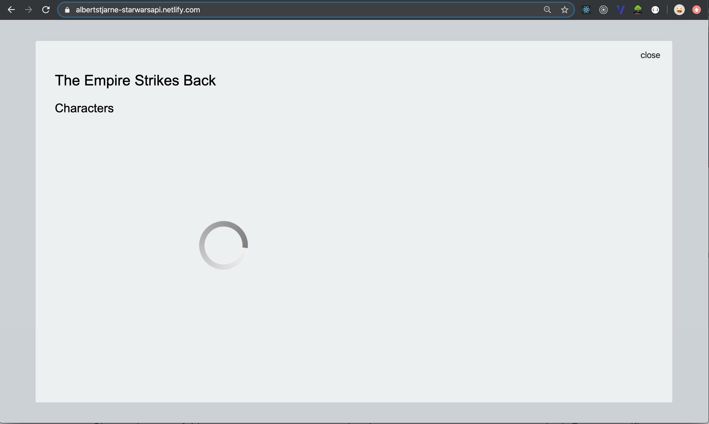

# A React application with data from the Star Wars API

This application has been built with React using data from the Star Wars API, SWAPI. When the site is loaded Star Wars films are fetched from the API. When clicking a film the characters of film are fetched and presented.

Only class-based components have been used.

The application was created for desktop with media queries for small screens.

The application is deployed @ [https://albertstjarne-starwarsapi.netlify.com/](https://albertstjarne-starwarsapi.netlify.com/)

## WIP - Next steps

As the project is work in progress, please find below next steps to dig into:

- Secure background color of overlay to #ecf0f1
- Make modal only being called once, now rendering one for each film
- Modal in mobile view to cover 100% of screen

## API used

The Star Wars API can be found @ [https://swapi.co/](https://swapi.co/)
 
 

## Using create-react-app

The project was initialized with create-react-app, [Create React App](https://github.com/facebook/create-react-app)

## Installed dependencies

The following dependencies have been installed in the project.
  
axios for making API requests [axios](https://www.npmjs.com/package/axios) 
`$ npm install axios`

react-modal for modals [react-modal](https://www.npmjs.com/package/react-modal) 
`$ npm install react-modal`

# Instructions to run the application

Run these commands in the project directory: 
Installing dependencies 
`$ npm install`

Starting the application in development mode 
`$ npm start`

This should open the application in the browser, otherwise go to: 
[http://localhost:3000](http://localhost:3000) 
The page will reload if you make code edits.

# Screenshots

Filmlist - desktop

Characters modal - desktop

Filmlist - mobile

Characters modal - mobile

Loaders

## Author

- Albert Stjärne (https://github.com/AlbertStjarne)
